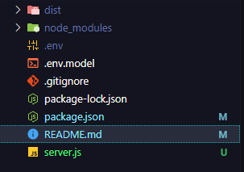

# express-from-deploy-static-pages
 
### Fazer o build do Projeto e deixar a pasta /dist na raiz deste projeto
- Se o nome da pasta for Build, Precisa alterar no codigo

## Usar o PM2 para deploy 

- Exemplo

